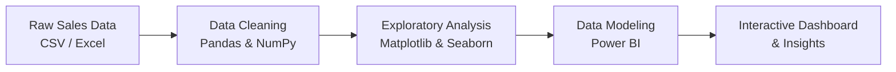

# 📝 Project Overview

This project analyzes **Amazon sales data** to extract meaningful insights that support business decision-making, sales trend identification, and customer behavior understanding. The analysis focuses on identifying **top-performing products**, **seasonal demand patterns**, and **sales growth opportunities**, and packages the findings into an interactive **Power BI dashboard**.

The workflow covers the full pipeline — from raw data cleaning in Python to visual storytelling in Power BI:



---

## 🎯 Objectives

- ✅ Clean and preprocess raw sales data for analysis
- ✅ Identify top-selling products and categories
- ✅ Detect seasonal trends and monthly performance patterns
- ✅ Calculate revenue, profit margins, and discount impacts
- ✅ Create visual dashboards for quick, actionable insights

---

## 🛠️ Tools & Technologies

| Category | Tools Used |
|---|---|
| **Data Cleaning & Analysis** | Python (Pandas, NumPy) |
| **Visualization (Python)** | Matplotlib, Seaborn |
| **Dashboarding** | Power BI |
| **Initial Exploration** | Microsoft Excel |

---

## 📂 Dataset

The repository includes multiple real-world sales and finance extracts used across the analysis:

| File | Description |
|---|---|
| `Amazon Sale Report.csv` | Core order-level Amazon sales transactions |
| `Sale Report.csv` | Consolidated internal sales report |
| `International sale Report.csv` | Cross-border/international order data |
| `May-2022.csv` | Monthly sales snapshot |
| `P & L March 2021.csv` | Profit & loss statement |
| `Expense IIGF.csv` | Business expense records |
| `Cloud Warehouse Compersion Chart.csv` | Warehouse cost/performance comparison |
| `Product_details.xlsx` | Product master/reference data |
| `Amazon Sales Report.pbix` | Power BI dashboard file |

> 📌 Large data files are tracked with **Git LFS** — run `git lfs pull` after cloning to fetch full file contents.

---

## 📈 Key Insights & Charts

- 🏆 **Top 5 products** contributed to **over 40% of total revenue**
- 📅 **Sales spiked** during **festive seasons and holiday months**
- 💸 **Discounts increased sales volume** but **reduced profit margins**
- 🔁 Certain categories showed **consistent, year-round demand**

<table>
<tr>
<td width="50%">


</td>
<td width="50%">


</td>
</tr>
<tr>
<td width="50%">


</td>
<td width="50%">


</td>
</tr>
</table>

> ℹ️ The charts above are illustrative visualizations rendered from the analysis patterns; the interactive, data-accurate figures are available in the Power BI dashboard below.

---

## 📊 Dashboard Snapshot


---

## 📂 Project Structure

```
Amazon-Sales/
│
├── data/                                  # Raw & cleaned datasets
│   ├── Amazon Sale Report.csv
│   ├── Sale Report.csv
│   ├── International sale Report.csv
│   ├── May-2022.csv
│   ├── P & L March 2021.csv
│   ├── Expense IIGF.csv
│   ├── Cloud Warehouse Compersion Chart.csv
│   └── Product_details.xlsx
│
├── images/                                # Generated charts & graphs
│   ├── top5_revenue_share.png
│   ├── monthly_sales_trend.png
│   ├── category_sales_distribution.png
│   └── discount_vs_margin.png
│
├── dashboard/
│   └── Amazon Sales Report.pbix           # Power BI dashboard file
│
├── docs/
│   └── Plan for a Powerful Power BI Dashboard.docx
│
└── README.md                              # Project documentation
```

---

## 🚀 How to Use

1. **Clone the repository**
   ```bash
   git clone https://github.com/pranjalpandey298/Amazon-Sales.git
   cd Amazon-Sales
   ```

2. **Pull large files (Git LFS)**
   ```bash
   git lfs install
   git lfs pull
   ```

3. **Explore the data with Python** (optional)
   ```bash
   pip install pandas numpy matplotlib seaborn
   ```

4. **Open the dashboard**
   Open `Amazon Sales Report.pbix` in **Power BI Desktop** to explore the interactive dashboard.

---

## 🔮 Future Scope

- Automate data refresh with a scheduled ETL pipeline
- Add predictive sales forecasting (e.g., Prophet / ARIMA)
- Build a customer segmentation (RFM) analysis
- Deploy the dashboard via Power BI Service for live sharing

---

## 📬 Contact

**Pranjal Pandey**
🔗 GitHub: [@pranjalpandey298](https://github.com/pranjalpandey298)

If you have questions or suggestions, feel free to open an issue or connect on GitHub!

⭐ If you found this project useful, consider giving it a **star**!

